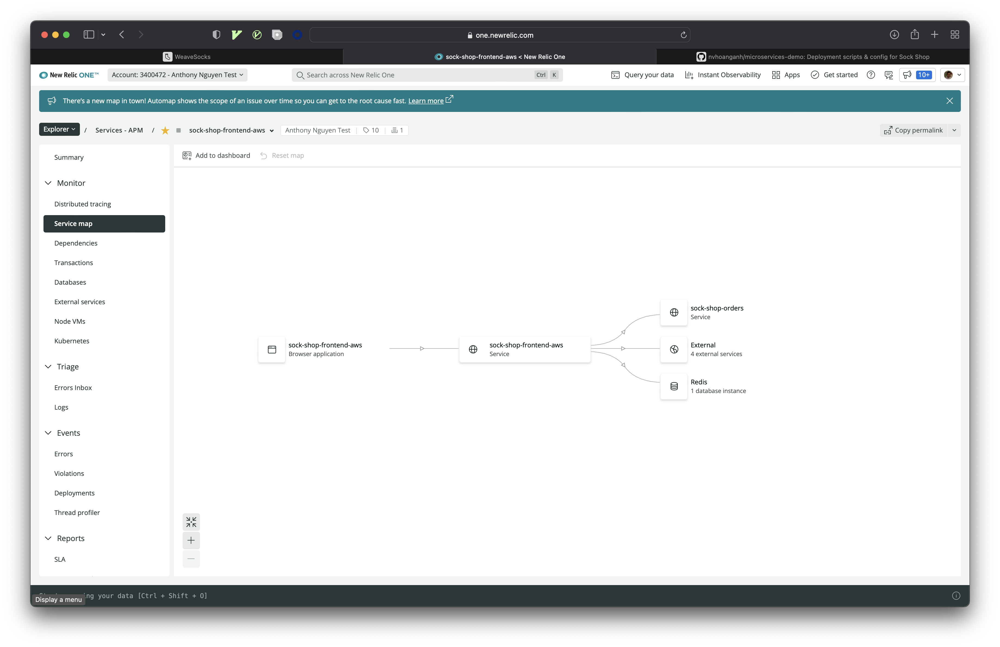

# New Relic Instant Observability workshop

Duration: **1.5 hours**

## Outcomes

-   Start observing your [k8s application](https://github.com/microservices-demo/microservices-demo/blob/master/internal-docs/design.md) in minutes, without instrumentation
-   Enable Distributed Traceing with New Relic APM
-   Monitor Real User Experience using Browser Monitoring
-   View application Errors in New Relic Errors Inbox
-   View Application Logs in Context

# Step 1. Monitor your cluster using Pixie without Instrumentation

-   Login to https://one.newrelic.com and click on `Add more data`
-   Search for `Kubernetes`
-   Enter a name for your Cluster and click `Continue`
-   Select `Scrape all Prometheus endpoints`, `Gather Log data` and `Instant Service-level insights ...` and click `Continue`
-   Select `Helm 3` from th drop down and copy the provided command

```bash
# run the command, make sure you replace LICENSE_KEY, YOUR_DEMO_NAME, PIXIE_API_KEY and PIXIE_DEPLOY_KEY
kubectl apply -f https://download.newrelic.com/install/kubernetes/pixie/latest/px.dev_viziers.yaml && \
kubectl apply -f https://download.newrelic.com/install/kubernetes/pixie/latest/olm_crd.yaml && \
helm repo add newrelic https://helm-charts.newrelic.com && helm repo update && \
kubectl create namespace newrelic ; helm upgrade --install newrelic-bundle newrelic/nri-bundle \
 --set global.licenseKey=LICENSE_KEY \
 --set global.cluster=YOUR_DEMO_NAME \
 --namespace=newrelic \
 --set newrelic-infrastructure.privileged=true \
 --set global.lowDataMode=true \
 --set ksm.enabled=true \
 --set kubeEvents.enabled=true \
 --set prometheus.enabled=true \
 --set logging.enabled=true \
 --set newrelic-pixie.enabled=true \
 --set newrelic-pixie.apiKey=PIXIE_API_KEY \
 --set pixie-chart.enabled=true \
 --set pixie-chart.deployKey=PIXIE_DEPLOY_KEY \
 --set pixie-chart.clusterName=YOUR_DEMO_NAME

 # make sure all pods are running
kubectl wait --for=condition=available --timeout=450s --all deployments -n newrelic
```

-   Browse your app again and come back to New Relic and select `Explorer > More > Kubernetes`

# Step 2. Add New Relic APM to see Distributed Tracing for critical transactions

-   You need NR Ingest key (login to NR1, select API Keys from your avatar drop down menu)
-   Replace `YOUR_NR_INGEST_API` with your Ingest key

```bash
# set local variable
# mac/ linux
YOUR_NR_INGEST_API=<Ingest Key>
# windows
set YOUR_NR_INGEST_API=<Ingest Key>

#ensure the variable is set
echo $YOUR_NR_INGEST_API

# Add APM for the NodeJS front-end
# set up up ENV variables
kubectl set env deployment/front-end \
    NEW_RELIC_LICENSE_KEY=$YOUR_NR_INGEST_API \
    NEW_RELIC_APP_NAME=sock-shop-frontend \
    NEW_RELIC_NO_CONFIG_FILE=true \
    NEW_RELIC_DISTRIBUTED_TRACING_ENABLED=true \
    --namespace=sock-shop

# deploy this version of the front end: https://github.com/nvhoanganh/front-end/tree/step-1---add-NR-APM
kubectl set image deployment/front-end \
    front-end=anthonynguyen334/sock-shop-frontend:AddNR_APM \
    -n sock-shop

# Add APM for the JAVA orders service
# set up up ENV variables
kubectl set env deployment/orders \
    JAVA_OPTS="-Xms64m -Xmx128m -XX:+UseG1GC -Djava.security.egd=file:/dev/urandom -Dspring.zipkin.enabled=false -javaagent:/usr/src/app/newrelic.jar -Dlogging.level.org.springframework=DEBUG" \
    NEW_RELIC_LICENSE_KEY=$YOUR_NR_INGEST_API \
    NEW_RELIC_LOG_FILE_NAME=STDOUT \
    NEW_RELIC_APP_NAME=sock-shop-orders \
    NEW_RELIC_DISTRIBUTED_TRACING_ENABLED=true \
    --namespace=sock-shop

# Add APM for the JAVA shipping service
# deploy this version of the orders: https://github.com/nvhoanganh/orders/tree/Add-APM-Agent
kubectl set image deployment/orders \
    orders=anthonynguyen334/sock-shop-ordersjava:apm \
    -n sock-shop

# Add APM for the JAVA shipping service
# set up up ENV variables
kubectl set env deployment/shipping \
    JAVA_OPTS="-Xms64m -Xmx128m -XX:+UseG1GC -Djava.security.egd=file:/dev/urandom -Dspring.zipkin.enabled=false -javaagent:/usr/src/app/newrelic.jar" \
    NEW_RELIC_LICENSE_KEY=$YOUR_NR_INGEST_API \
    NEW_RELIC_LOG_FILE_NAME=STDOUT \
    NEW_RELIC_APP_NAME=sock-shop-shipping \
    NEW_RELIC_DISTRIBUTED_TRACING_ENABLED=true \
    --namespace=sock-shop

# Add APM for the JAVA shipping service
# deploy this version of the shipping: https://github.com/nvhoanganh/shipping/tree/Add-APM-Agent
kubectl set image deployment/shipping \
    shipping=anthonynguyen334/sock-shop-shipping:apm \
    -n sock-shop

# wait until all pods are in running state
kubectl get pods -n sock-shop
```

-   Generate some traffic: browse the app again, add an item in the card, then click on the Cart to view it
-   Login to https://one.newrelic.com and select `Explorer > Services - APM > sock-shop-frontend`
    

# Step 3. Add New Relic Browser Monitoring

-   Go to https://one.newrelic.com, click on `Add more data`, search for Browser, select correct Account and click Continue
-   Select `Copy/paste Javascript code`
-   Leave all of the default options
-   For Name your app: Select Yes and search for `sock-shop-frontend` and click on `Enable`
-   Scroll to the bottom of the provided snippet, you should see something like this below

```javascript
....
;NREUM.loader_config={accountID:"3400472",trustKey:"1100964",agentID:"737257148",licenseKey:"NRJS-fd3771cb8dbe078e944",applicationID:"737257148"}
;NREUM.info={beacon:"bam.nr-data.net",errorBeacon:"bam.nr-data.net",licenseKey:"NRJS-fd3771cb8dbe078e944",applicationID:"737257148",sa:1}
</script>
```

-   From the above, you will need to get the following information
    -   NEW_RELIC_ACCOUNT_ID: from `accountID`
    -   NEW_RELIC_TRUST_KEY: from `trustKey`
    -   NEW_RELIC_BROWSER_LICENSE_KEY: from `licenseKey`
    -   NEW_RELIC_APP_ID: from `applicationID`

```bash
# add the above 4 ENV variables, remember to replace the values you get from above
kubectl set env deployment/front-end \
    NEW_RELIC_ACCOUNT_ID=3400472 \
    NEW_RELIC_TRUST_KEY=1100964 \
    NEW_RELIC_BROWSER_LICENSE_KEY=NRJS-fd3771cb8dbe078e944 \
    NEW_RELIC_APP_ID=737257148 \
    --namespace=sock-shop

# deploy this version of the front end: https://github.com/nvhoanganh/front-end/tree/step2-add-browser-monitoring
kubectl set image deployment/front-end \
    front-end=anthonynguyen334/sock-shop-frontend:AddNR_RUM \
    -n sock-shop

# wait until all pods are in running state
kubectl get pods -n sock-shop
```

-   Browser the Weave Socks Shop app
-   Login to https://one.newrelic.com and select `Explorer > Browser applications`

# Step 4. Add Logs In Context

-   To enable Logs in Context

```bash
# deploy this version of the front end: https://github.com/nvhoanganh/front-end/tree/step3-add-logs-in-Context
kubectl set image deployment/front-end \
    front-end=anthonynguyen334/sock-shop-frontend:AddNR_LogsInContext \
    -n sock-shop

# wait until all pods are in running state
kubectl get pods -n sock-shop
```

-   Browser the Weave Socks Shop app
-   Login to https://one.newrelic.com and select `Explorer > Services - APM` and select `Sock shop frontend`
-   Select `Logs`

# Step 5. View Errors in Errors Inbox

-   To view Errors in Errors Inbox

```bash
# deploy this version of the front end: https://github.com/nvhoanganh/front-end/tree/step-4-View-Errors-in-Error-Inbox
kubectl set image deployment/front-end \
    front-end=anthonynguyen334/sock-shop-frontend:AddNR_Errors \
    -n sock-shop

# Set Repository and commit information
kubectl set env deployment/front-end \
    NEW_RELIC_METADATA_REPOSITORY_URL=https://github.com/nvhoanganh/front-end.git \
    NEW_RELIC_METADATA_COMMIT=68c70ed16c951f73b3380c928deca2a8b3888698 \
    --namespace=sock-shop

# wait until all pods are in running state
kubectl get pods -n sock-shop
```

-   Login to https://one.newrelic.com, click on `Explorer > Workloads views` and click on `Create a workload`
-   Enter name of workload `Sock shop on AWS` and select the correct account
-   Enter `sock-shop` in the search box and hit enter
-   Add `sock-shop-frontend (Service - APM)` and `sock-shop-frontend (Browser application)`
-   Click on `Create a workload`
-   Generate some error by:
    -   Navigating to the Weave Socks Shop app
    -   Add item to the cart
    -   Go to the cart and update the Quantity to 20, click on `Update basket`
    -   Note: if you look at the Network tab on your browser you will see the Update call failed
-   Go back to https://one.newrelic.com and Select `Explorer > Errors Inbox` and select `Sock shop on AWS` from the drop down
-   Click on the error

# Clean up your Resources

```bash
# delete the AWS EKS cluster
eksctl delete cluster --name pixiecluster --region us-east-1
```
